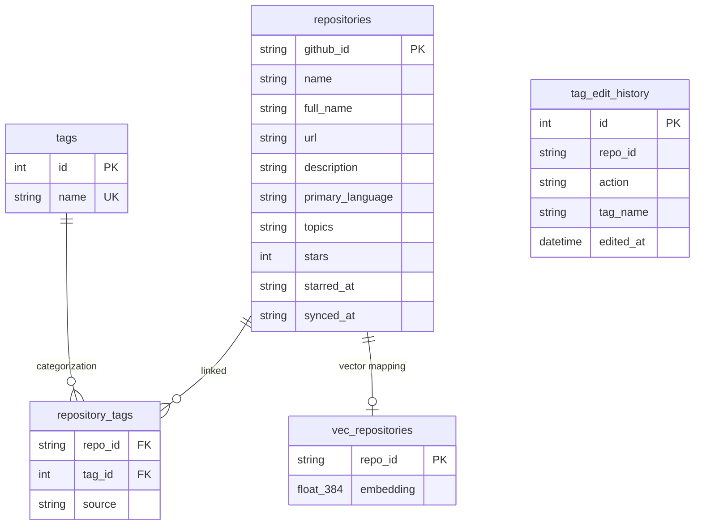

# システムアーキテクチャ

## パッケージ構成

モノレポ構成（uv workspaces）を採用し、責務を分離しています。

- `packages/collector`: データ収集担当。GitHub GraphQL APIとの通信、同期ロジック。
- `packages/processor`: データ処理担当。SQLite DB管理、タグ付けエンジン(Strategy)、類似検索エンジン(Strategy)。
- `packages/tui`: インターフェース担当。TextualによるUI実装、設定管理、CLIエントリポイント。
- `config/tags.yaml`: タグ付けルール定義ファイル（ユーザー編集可能）。

## クラス図 (コアロジック)

```mermaid
classDiagram
    direction LR
    class TUIApp {
        +run()
    }
    class GitHubClient {
        +fetch_starred_repos()
    }
    class SyncEngine {
        +incremental_sync()
        +full_sync()
    }
    class Repository {
        +upsert_repo()
        +get_all()
    }
    class TaggerStrategy {
        <<interface>>
        +suggest_tags()
        +learn()
    }
    class RuleBasedTagger {
    }
    class MlTagger {
    }
    class LlmTagger {
        -Ollama Client
    }
    class SimilaritySearchStrategy {
        <<interface>>
        +find_similar()
        +rebuild_index()
    }
    class TfidfSearch {
    }
    class EmbeddingSearchStrategy {
    }
    
    TUIApp --> SyncEngine
    TUIApp --> Repository
    TUIApp --> SimilaritySearchStrategy
    SyncEngine --> GitHubClient
    SyncEngine --> Repository
    SyncEngine --> TaggerStrategy
    TaggerStrategy <|-- RuleBasedTagger
    TaggerStrategy <|-- MlTagger
    TaggerStrategy <|-- LlmTagger
    SimilaritySearchStrategy <|-- TfidfSearch
    SimilaritySearchStrategy <|-- EmbeddingSearchStrategy
    RuleBasedTagger ..> "tags.yaml" : 読み込み
```

## DBスキーマ (ER図)



## 資源管理 (Resource Management)

データベース接続（SQLite）の扱いについては、ファイル記述子の枯渇（Errno 24: Too many open files）を防ぐため、以下の原則を徹底しています。

- **明示的なクローズ**: `with sqlite3.connect(...)` はトランザクションのみを管理し接続を閉じないため、自前の `get_db_connection` コンテキストマネージャを使用して必ず `conn.close()` を呼び出します。
- **一過性接続**: 特にループ内で重い処理（LLM推論等）を行う場合は、都度接続を開閉してリソースを解放します。
- **コネクションの再利用**: 特定の画面（DetailScreenなど）の初期化中など、コンテキストが明らかな場合は既存の接続を関数間で使い回し、冗長なファイルオープンを避けます。
