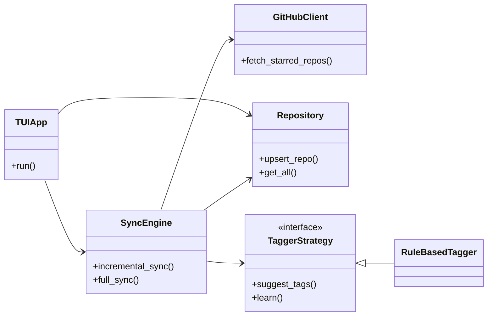
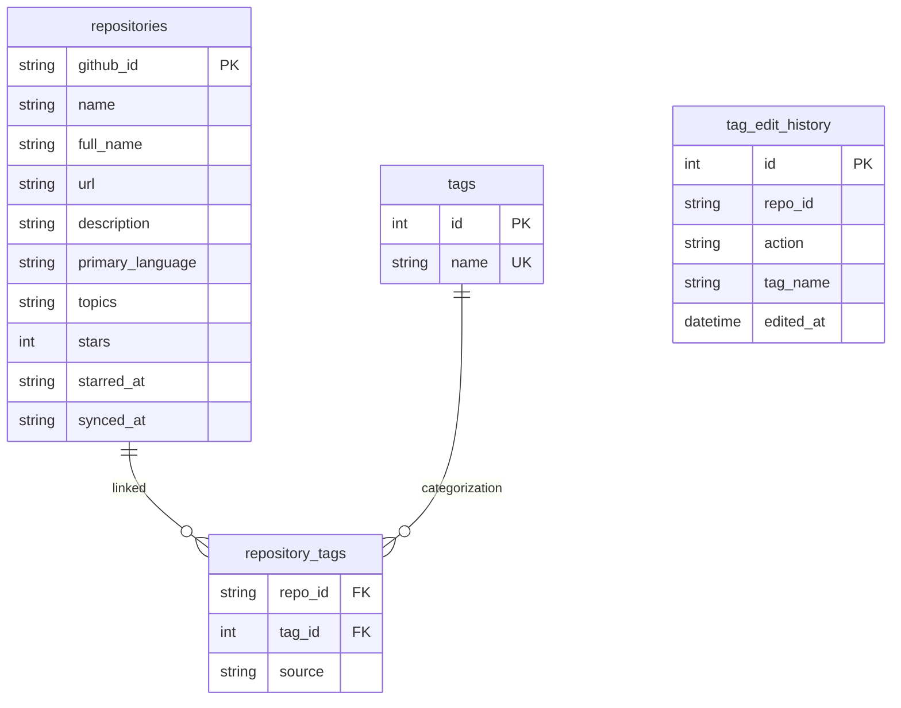

# システムアーキテクチャ

## パッケージ構成

モノレポ構成（uv workspaces）を採用し、責務を分離しています。

- `packages/collector`: データ収集担当。GitHub GraphQL APIとの通信、同期ロジック。
- `packages/processor`: データ処理担当。SQLite DB管理、タグ付けエンジン(Strategy)、類似検索エンジン(Strategy)。
- `packages/tui`: インターフェース担当。TextualによるUI実装、設定管理、CLIエントリポイント。

## クラス図 (コアロジック)

## DBスキーマ (ER図)

